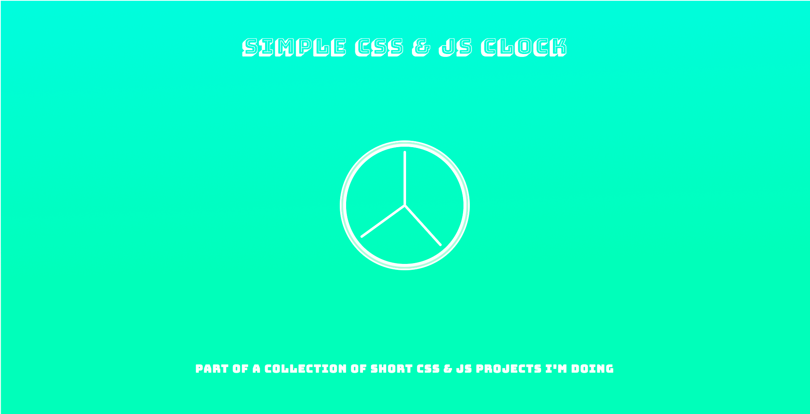

## CSS and JS Clock

### README

A simple CSS &amp; JS Clock. A Simple `js` and `css` project.

### Install
 Clone on your local machine and do a npm install.
 Here is the [demo](http://codepen.io/intercoder/pen/0a7aa8be6c89bf0d5ac133b173dd35f6?editors=1100) on codepen. You can take a look at [cssclock](http://cssclock.site)

### TODO
- [x] Clean codepen demo - add link
- [x] Publish to github pages
- [x] Add gulp task
- [ ] Import fonts
- [x] Add domain
- [ ] Add link to github repo
- [ ] Add link to style documentation
- [x] Add license
- [ ] Write Case Study
- [x] Add ~~background~~ design (affinity) - added simple gradient
- [x] Add pictures to readme

Made with ❤  2016 Belgium - D/S
